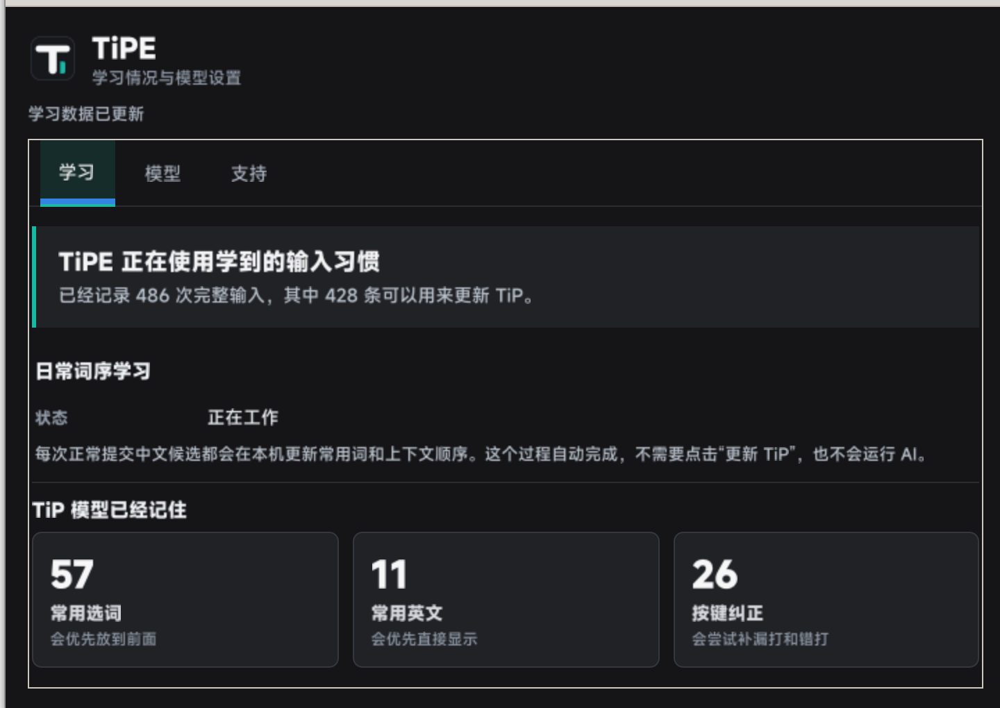

<p align="center">
  
</p>

<h1 align="center">TiPE</h1>

<p align="center">
  <strong>会记住你怎么打字的中文拼音输入法</strong>
</p>

<p align="center">
  面向 fcitx5 的 Linux 中文输入方案：先把输入法基本功做好，再用本地学习和按需模型理解个人输入习惯。
</p>

<p align="center">
  
  
  
  
</p>

<p align="center">
  
</p>

<p align="center"><sub>真实 GTK 窗口截图，数值为演示数据。</sub></p>

## TiPE 想解决什么

普通拼音输入法主要理解“你现在打了什么”。TiPE 还会在安全边界内记录“你是怎么打的”：

| 真实输入情况 | TiPE 的处理方向 |
| --- | --- |
| 长拼音先选前半句 | 提交已选文字，保留并继续处理剩余拼音 |
| 挂着中文输入法写 `github`、`docker` | 提供原样英文候选，并从重复选择中学习 |
| 经常漏打、错打或交换某个键 | 结合删除、重打和最终选择，形成带阈值的个人纠错证据 |
| 同一个词总要翻页寻找 | 本机词序学习和显式选择会逐步调整候选顺序 |
| 需要更强的上下文判断 | 只在点击分析或按 `F9` 时调用所选本地/云端模型 |

TiPE 不是后台常驻一个大模型。普通打字走 C++、LibIME 和轻量本地数据；TiP 训练及大模型分析均按需执行。

## 当前能力

| 模块 | 状态 | 说明 |
| --- | --- | --- |
| 中文拼音与长句输入 | 可用 | 优先使用 LibIME，支持前缀选词和剩余拼音保留 |
| 中英文混输 | 可用 | 支持英文标识符、大小写原样提交和中文后缀组合 |
| 候选窗口 | 可用 | 默认单行，向下展开多列，支持数字、方向键和鼠标选择 |
| 光标跟随 | 可用 | 覆盖 Wayland、DBus/GTK、XIM，并为 Wine 提供按需桥接 |
| 日常词序学习 | 可用 | 使用独立的 LibIME 用户历史，不修改 fcitx5-pinyin 数据 |
| TiP 个人模型 | 开发中 | 学习选词、英文倾向和按键纠错，更新前带验证门槛 |
| 本地/云端模型 | 可用 | 支持 llama.cpp、Ollama、OpenAI 及兼容接口，按需调用 |
| 全应用一致性 | 持续完善 | 精确光标位置仍受应用和输入协议实现质量影响 |

当前版本是 **0.1.0 开发预览**。它已经可以真实试用，但还不是面向所有发行版的一键安装成品。

## 学习是怎么工作的

| 阶段 | TiPE 做什么 | 运行方式 |
| --- | --- | --- |
| 1. 接收输入 | 处理 fcitx5 交给 TiPE 的按键、编辑和选词结果 | 输入时轻量记录 |
| 2. 有界监督 | 提取选词习惯、英文倾向和漏键纠错线索，并限制记录容量 | 本机自动完成 |
| 3. 分层学习 | 日常词序自动调整；TiP 点击后训练；本地或云端模型按需分析 | 用户可分别控制 |
| 4. 校验应用 | 只有通过本地校验的结果才会影响候选排序、个人纠错和英文倾向 | 更新时执行 |

TiPE 只监督当前输入上下文真正交给输入法的按键。桌面环境先行拦截的全局快捷键，任何普通输入法都无法读取；密码和敏感输入框会直接关闭监督、学习、模型调用与弹窗。

## 快速开始

### 1. 准备依赖

- Linux 与 fcitx5
- CMake 3.20 以上
- 支持 C++20 的编译器
- fcitx5、Wayland、PangoCairo、GTK4、gtk4-layer-shell、XCB 开发文件
- 推荐安装 LibIME Pinyin；libpinyin 可作为后备
- 可选：MinGW C++ 交叉编译器，用于构建 Wine 光标桥

### 2. 构建和测试

```bash
git clone https://github.com/meovv-w/TiPE.git
cd TiPE

./scripts/build.sh
./scripts/smoke-test.sh
```

`build.sh` 默认限制并行任务并降低构建优先级，避免开发过程抢占桌面输入响应。

### 3. 安装到当前用户

```bash
./scripts/install.sh --dry-run
./scripts/install.sh
```

安装位置是 `~/.local`。脚本不会修改 fcitx5 profile、全局输入法配置或桌面快捷键，也不会自行切换当前输入法。

确认愿意改变当前输入会话后，再执行：

```bash
./scripts/restart-fcitx5.sh --dry-run
./scripts/restart-fcitx5.sh
fcitx5-remote -n
```

完整安装说明见 [安装与使用](docs/usage.md)。

## 常用操作

| 操作 | 作用 |
| --- | --- |
| `Space` | 提交当前候选；没有候选时提交原始拼音 |
| `Enter` | 原样提交当前输入 |
| `Backspace` | 删除光标前的拼音 |
| `Delete` | 删除光标后的拼音，或监督应用内删除行为 |
| `Down` | 展开候选网格并向下一行移动 |
| `Up` | 在展开网格中向上一行移动 |
| `Left / Right` | 移动候选；回到最左后可继续编辑拼音 |
| `Tab / Shift+Tab` | 前后移动候选 |
| `F9` | 对当前输入运行一次所选模型分析 |
| `Shift+F9` | 切换进程内轻量连续模式，不连续调用外部模型 |
| `tipe-toggle` | 在 TiPE 内切换中文与英文模式 |

打开学习与模型窗口：

```bash
tipe-supervision-window
```

窗口只有三个主要页面：

- **学习**：已经记录多少完整输入，学会了多少选词、英文和纠错习惯。
- **模型**：选择 TiP、本地模型或云端模型，并配置 API。
- **支持**：显示微信和支付宝支持码。

## 模型选择

| 方式 | 是否联网 | 什么时候运行 | 适合用途 |
| --- | --- | --- | --- |
| 日常 LibIME 学习 | 否 | 正常选词后 | 常用词和上下文词序 |
| TiP | 否 | 点击“更新 TiP” | 个人选词、英文倾向、按键纠错 |
| llama.cpp + GGUF | 否 | 点击分析或按 `F9` | 一次性本地大模型判断 |
| Ollama | 本机接口 | 点击分析或按 `F9` | 已有本地模型服务 |
| OpenAI/兼容 API | 是 | 点击分析或按 `F9` | 更强的远端重排与纠错建议 |

云端模式默认只发送当前拼音、候选和候选窗口状态。“近期按键”和“光标附近文字”必须分别主动开启。API Key 单独保存在权限为 `0600` 的文件中，不写进命令行参数和诊断输出。

详细说明见 [模型与学习](docs/model.md)。

## 隐私和性能边界

- 不运行后台常驻大模型。
- 活动监督快照最多每 250 ms 合并写入一次，普通历史最多每 2 秒采样一次。
- 完整训练记录有大小上限，并按完整记录裁剪。
- 密码、敏感字段和客户端明确禁用输入法的上下文不会被记录。
- 持久历史会移除原始光标附近文字和已提交上下文，只保留受限特征与行为证据。
- 模型结果不能直接写入词库，必须先通过候选、纠错和分段链校验。

## 文档

- [安装与使用](docs/usage.md)
- [模型与学习](docs/model.md)
- [架构说明](docs/architecture.md)
- [排查与调试](docs/debugging.md)
- [第三方源码与许可证](third_party/README.md)

## 项目结构

```text
addon/       fcitx5 插件与输入法元数据
data/        图标、桌面入口和支持页资源
docs/        中文使用、模型、架构与调试文档
scripts/     构建、安装、模型、训练和诊断工具
src/         输入状态机、候选窗口、fcitx5 引擎和 TiPE UI
tests/       状态机、模型协议、安装和回归测试
tools/       可重复状态探针与 Wine 光标工具
```

## 支持 TiPE

TiPE 仍在持续开发。付款前请在手机上核对收款人。

<table>
  <tr>
    <td align="center">
      <br>
      <strong>微信</strong>
    </td>
    <td align="center">
      <br>
      <strong>支付宝</strong>
    </td>
  </tr>
</table>

问题和可重复用例可以直接提交到 [GitHub Issues](https://github.com/meovv-w/TiPE/issues)。准备修改代码时请先阅读 [参与开发](CONTRIBUTING.md)。
