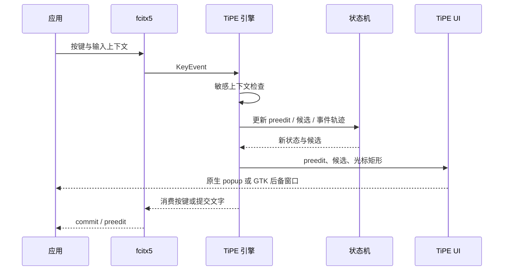

# TiPE 架构说明

本文面向准备阅读或修改 TiPE 源码的人。用户安装和操作请先看 [安装与使用](usage.md)，模型配置请看 [模型与学习](model.md)。

## 设计目标

TiPE 当前有四个核心目标：

1. 先提供可靠的中文拼音输入、候选选择、长句分段和中英文混输。
2. 记录输入法真正收到的按键行为，但不给普通打字路径增加常驻模型负担。
3. 把自动词序学习、个人行为模型和外部大模型分层，避免一种学习机制控制全部行为。
4. 在 Wayland、DBus/GTK、XIM 和 Wine 等不同前端中尽量保持同一套候选逻辑和视觉。

它不是全局键盘记录器，也不尝试绕过桌面环境、应用或密码框的输入安全边界。

## 进程和模块

### fcitx5 引擎：`libtipe.so`

主要代码位于：

- `src/engine.cpp`
- `src/engine.h`

引擎负责：

- 接收 fcitx5 输入上下文和按键事件。
- 为每个输入上下文维护独立 `State`。
- 处理中文/英文模式、提交、删除、候选移动和模型触发。
- 把 preedit、候选和光标矩形交给 TiPE UI。
- 写入有界监督快照和训练历史。
- 在密码或敏感上下文中清空状态并禁用监督。

### 输入状态机：`tipe_state`

静态库由这些模块组成：

| 文件 | 责任 |
| --- | --- |
| `src/state.cpp` | preedit、光标、候选、分段提交、撤销和事件轨迹 |
| `src/dictionary.cpp` | LibIME/libpinyin/Rime/用户词典和后备词典 |
| `src/input_model.cpp` | 候选偏好、纠错规则、英文倾向和模型请求 |
| `src/pass_through_supervisor.cpp` | 英文模式及未进入 preedit 的按键监督 |
| `src/supervision_snapshot.cpp` | 监督快照的裁剪、持久化和隐私过滤 |
| `src/candidate_snapshot.cpp` | 状态机到候选窗口协议的序列化 |

状态机不依赖 GTK，也不需要启动 fcitx5，因此大部分输入行为可以通过单元测试和 `tipe-state-probe` 重放。

### fcitx5 UI 插件：`libtipeui.so`

主要代码位于：

- `src/tipe_ui.cpp`
- `src/tipe_wayland_surface.cpp`
- `src/tipe_ui_public.h`

UI 插件根据当前前端选择路径：

1. Wayland input-method-v2：使用 compositor 提供的 popup surface 和 text rectangle。
2. DBus/GTK：使用 TiPE GTK 候选窗口，并换算前端缩放后的全局矩形。
3. XIM：使用客户端 spot location；缺失时采用受限后备位置。
4. Wine：仅在需要时启动 MSAA 光标桥，读取插入点而不是文本内容。

部分浏览器声明 `ClientSideInputPanel` 后会自行绘制候选。TiPE 在自己的 UI 激活时通过导出的插件接口直接更新 `tipeui`，让浏览器和终端继续使用同一渲染器；客户端 preedit 仍由 fcitx5 正常传递。

### GTK 后备候选窗口

`src/candidate_window.cpp` 构建 `tipe-candidate-window`，负责：

- 单行收起布局和多列展开布局。
- 变宽候选格、空位回填和数字标签。
- 屏幕边缘约束、缩放换算和点击命中。
- XIM、Wine 和无法使用原生 popup 时的窗口定位。
- 非 IMM Wine 控件中的透明 preedit 覆盖层。

候选文字、格子测量和渲染参数由共享头文件提供，避免原生 Wayland UI 与 GTK 后备 UI 逐渐变成两套样式。

### 学习与模型窗口

`src/learning_panel_window.cpp` 构建 `tipe-learning-panel-window`。普通入口是 `tipe-supervision-window`，它通过 `scripts/learning-panel.sh` 汇总本地状态，再显示三个页面：

- 学习：词序学习状态、可训练记录和已经激活的 TiP 能力。
- 模型：TiP、本地大模型、云端大模型及相应配置。
- 支持：项目支持码。

窗口刷新本身不调用模型。只有“更新 TiP”“分析当前输入”或输入过程中的显式 `F9` 会执行对应动作。

## 一次按键的路径



引擎只处理 fcitx5 交付的事件。窗口管理器先消费的全局快捷键不会进入这条路径。

## 拼音和候选

### 候选来源

TiPE 按可用性组合以下来源：

1. LibIME Pinyin：首选，提供与 fcitx5-pinyin 同源的系统词典和语言模型。
2. libpinyin：LibIME 不可用时的后备解码器。
3. 已安装 Rime 词典：用于受限的精确词和中英文混合匹配。
4. TiPE 用户词典：保存用户确认过的完整新词。
5. 内置最小后备词典：保证缺少外部后端时仍能进行基本测试和输入。

不同来源先转换成统一候选元数据，再由排序层处理。`consumed_prefix` 明确表示候选消耗了多少拼音，不能用“候选文字是否是另一候选的前缀”来猜。

### 分段提交

例如当前 preedit 是 `nihao`，用户选择只消耗 `ni` 的“你”：

1. “你”提交到应用和当前组合上下文。
2. preedit 更新为 `hao`。
3. 最近提交上下文帮助 `hao` 优先出现“好”。
4. 删除已提交前缀时，完整 preedit 可以恢复。
5. 完整分段链在确认达到阈值后可以形成用户词条。

这一逻辑是防止“选一个短词后剩余拼音消失”的核心，状态机测试覆盖单字、多字、纠错前缀和中英文混合前缀。

### 候选导航

候选流只有一份。收起和展开只是同一候选序列的两种布局：

- 收起时显示一行。
- 展开时使用固定列数的网格。
- 长候选可占多个格宽，短候选会回填可用空位。
- 数字只标记当前可直接选择的一行，不把两位数候选伪装成单键数字。

## 三层学习

### 1. LibIME 日常词序

正常提交中文候选后，TiPE 更新自己的 LibIME 用户历史：

```text
~/.local/share/tipe/libime/user.history
```

这层自动、轻量、无需 TiP，也不会写入 fcitx5-pinyin 的用户历史。

### 2. 轻量行为证据

TiPE 保存带上限的：

- 显式候选偏好。
- 原样英文选择。
- 拼音纠错对。
- 分段选择链。
- 经过阈值发布的按键位置习惯。

一次偶然操作通常只作为证据，不会立即改变所有候选。候选偏好、英文倾向和通用纠错分别使用不同激活阈值。

### 3. TiP 与外部模型

TiP 是 TiPE 自带的个人行为模型。训练时读取终止输入记录，生成带版本和验证结果的模型文件；运行时把安全能力蒸馏成 C++ 可读取的有界规则，不需要每次按键启动 Python。

外部模型只通过版本化 TSV 请求和受限输出协议连接。允许写回的结果只有：

- 对现有候选重新排序。
- 当前拼音到修正拼音的纠错。
- 当前拼音的明确候选偏好。
- 可验证的分段链。

模型不能返回任意 shell 命令或绕过本地校验直接修改词库。

## 监督数据与隐私

运行时主要文件位于 `$XDG_CACHE_HOME/tipe`，未设置时使用 `~/.cache/tipe`：

| 文件 | 用途 |
| --- | --- |
| `supervision-current.tsv` | 当前活动输入的最新快照 |
| `supervision-last.tsv` | 最近一次完成输入的隐私过滤快照 |
| `supervision-history.tsv` | 有界的一般历史 |
| `supervision-training-history.tsv` | 只包含终止选择、原样提交和取消的训练历史 |

活动快照可能暂时含有当前模型调用所需的受限上下文。写入 last/history 前会移除原始周边文字和已提交文本，只保留特征、按键轨迹、拼音、候选和真实选择。

以下输入上下文立即关闭监督：

- fcitx5 `Password`
- fcitx5 `Sensitive`
- 客户端 `Disable`

关闭时会清除该上下文拥有的 preedit、待写快照、可恢复状态和状态提示。

## 性能策略

- 普通候选生成和排序位于 C++ 进程内。
- 活动快照最多每 250 ms 合并写入一次。
- 非终止一般历史最多每 2 秒采样一次。
- 终止选择立即写入，保证最终监督链不会被合并丢失。
- TiP 训练默认以 `nice 10` 单次执行。
- 构建默认最多四个并行任务并使用 `nice 5`。
- 外部模型在工作线程中运行，带 1 到 30 秒超时和进程组清理。
- 连续模式只运行进程内轻量逻辑，不按键调用云端或本地大模型。

## 安装边界

`scripts/install.sh` 只写当前用户的 `~/.local`：

1. 检查构建测试指纹。
2. 把完整 CMake 安装先写入私有临时目录。
3. 验证所有文件和重写后的 addon 元数据。
4. 用同目录原子重命名替换最终文件。

安装脚本不会编辑 fcitx5 profile、niri 配置或系统输入法配置。`scripts/uninstall.sh` 只删除 `scripts/installed-files.sh` 明确管理的文件。

## 测试结构

`./scripts/build.sh` 会构建并执行 CTest。当前测试覆盖：

- 状态机、长句分段、候选导航和学习排序。
- 训练导出与 TiP 训练/验证。
- OpenAI/Ollama 兼容 HTTP 请求和响应过滤。
- 中文/英文模式切换与 fcitx5 重启辅助脚本。
- 英文 pass-through 监督。
- 候选窗口和学习窗口自测。

`./scripts/smoke-test.sh` 进一步检查脚本语法、模型配置组合、原子安装、卸载清单、资源完整性和历史回归用例。

## 明确不做的事

- 不读取窗口管理器没有交给输入法的全局按键。
- 不在密码和敏感字段里学习。
- 不默认把周边文字上传到云端。
- 不让模型输出直接成为任意词库修改。
- 不自动编辑用户的 fcitx5 profile 或桌面快捷键。
- 不承诺所有应用都提供同样准确的光标矩形；TiPE 会使用协议内可获得的最佳信息和受限后备路径。
